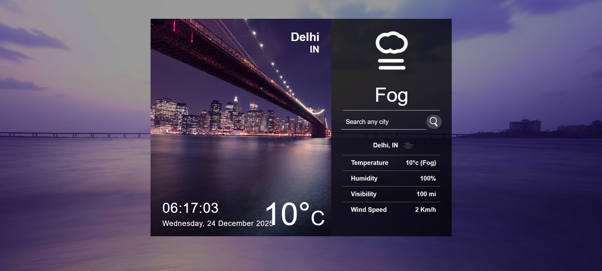

<div align="center">


# 🌤️ Live Weather App

### Real-time Weather Forecasting Application

[](https://app.netlify.com/projects/weather-forcasting-temperature/deploys)
[](https://reactjs.org/)
[](LICENSE)
</div>

---

## 🎯 About

<p align="justify">A beautiful, responsive weather application built with React that provides real-time weather information for any location worldwide. Get instant access to current weather conditions, temperature, humidity, wind speed, and more!</p>

---

## 🚀 Live Demo

Try the live version of the app:

[](https://weather-forcasting-temperature.netlify.app/)

---

## ✨ Features

<table>
  <tr>
    <td>🌍</td>
    <td><b>Geolocation Support</b><br/>Automatically detects your location for instant weather updates</td>
  </tr>
  <tr>
    <td>🔍</td>
    <td><b>City Search</b><br/>Search weather for any city worldwide</td>
  </tr>
  <tr>
    <td>🌡️</td>
    <td><b>Real-time Data</b><br/>Live temperature, humidity, and weather conditions</td>
  </tr>
  <tr>
    <td>🎨</td>
    <td><b>Animated Icons</b><br/>Beautiful weather animations that match conditions</td>
  </tr>
  <tr>
    <td>⏰</td>
    <td><b>Live Clock</b><br/>Real-time clock with current date display</td>
  </tr>
  <tr>
    <td>📱</td>
    <td><b>Responsive Design</b><br/>Optimized mobile layout with stackable elements and auto-adjusting containers</td>
  </tr>
  <tr>
    <td>✨</td>
    <td><b>Custom Favicon</b><br/>Unique transparent SVG weather icon for clear visibility on all themes</td>
  </tr>
  <tr>
    <td>💨</td>
    <td><b>Wind Speed</b><br/>Current wind speed information</td>
  </tr>
  <tr>
    <td>👁️</td>
    <td><b>Visibility</b><br/>Atmospheric visibility data</td>
  </tr>
</table>

---

## 🛠️ Tech Stack

<div align="left">


</div>

### 📦 Dependencies

| Package | Purpose |
|---------|---------|
| `react` | UI framework |
| `axios` | HTTP requests |
| `react-animated-weather` | Weather icons |
| `react-live-clock` | Real-time clock |
| `react-geolocated` | Geolocation services |

---

## 🚀 Getting Started

### Prerequisites

Before you begin, ensure you have the following installed:

- 
- 

### 📥 Installation

1. **Clone the repository**

```bash
git clone https://github.com/ajaygangwar945/Weather-App.git
cd Weather-App
```

1. **Install dependencies**

```bash
npm install
```

1. **Get your API key**

- Visit [OpenWeatherMap](https://openweathermap.org/api)
- Sign up for a free account
- Generate your API key

1. **Configure API key**

Open `src/apiKeys.js` and add your API key:

```javascript
module.exports = {
  key: "YOUR_API_KEY_HERE",
  base: "https://api.openweathermap.org/data/2.5/",
};
```

1. **Start the development server**

```bash
npm start
```

1. **Open your browser**

Navigate to [http://localhost:3000](http://localhost:3000)

---

## 💻 Usage

### Search for a City

1. Type the city name in the search bar
2. Click the search icon or press Enter
3. View real-time weather data

### Allow Location Access

1. Click "Allow" when prompted for location access
2. The app will automatically display weather for your current location

---

## 🌐 Deployment

### Deploy to Netlify

[](https://app.netlify.com/start/deploy?repository=https://github.com/ajaygangwar945/Weather-App)

### Manual Deployment

```bash
# Build the production version
npm run build

# Deploy the 'build' folder to your hosting service
```

**Supported Platforms:**

- ✅ Netlify
- ✅ Vercel
- ✅ GitHub Pages
- ✅ Firebase Hosting

---

## 📸 Screenshots

<div align="center">
  
  <p><i>Home screen showing current weather</i></p>

</div>

---

## 🤝 Contributing

Contributions are what make the open-source community such an amazing place to learn, inspire, and create. Any contributions you make are **greatly appreciated**!

1. Fork the Project
2. Create your Feature Branch (`git checkout -b feature/AmazingFeature`)
3. Commit your Changes (`git commit -m 'Add some AmazingFeature'`)
4. Push to the Branch (`git push origin feature/AmazingFeature`)
5. Open a Pull Request

---

## 📝 License

This project is licensed under the MIT License.

---

## 🙏 Acknowledgments

- [](https://openweathermap.org/)
- [](https://www.npmjs.com/package/react-animated-weather)
- [](https://www.netlify.com/)

---

<div align="center">

### ⭐ Star this repository if you found it helpful

Made with ❤️ by Ajay Gangwar

</div>
